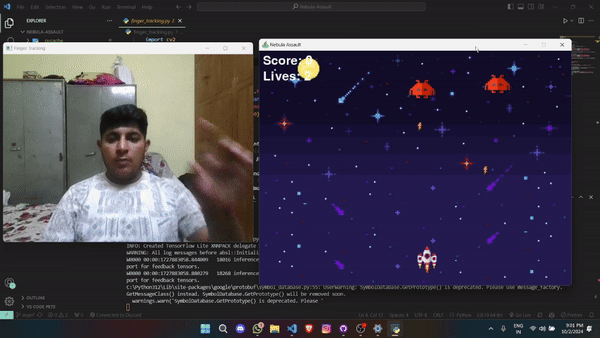

ult</h1>

<p align="center">
    
    
</p> 

<p align="center"><
    
    
    strong>Nebula Assault</strong> is a retro-style space shooter game developed using Python and Pygame. Players control a spaceship and must survive waves of enemy ships, shoot down enemies, and eventually defeat a boss with erratic movements and homing bullets.</p>

---



## Features

- **Finger Tracking Integration**: Use finger tracking to control the spaceship and shoot. (Requires webcam)
- **Enemies and Boss**: Battle against waves of enemies and a powerful boss with unpredictable movement patterns.
- **Sound Effects**: Engaging sound effects for explosions, firing, and player damage.
- **Scoring System**: Track your score and lives during the game.
- **Challenging Gameplay**: Face enemies that shoot back, and watch out for the homing bullets from the boss.

## Table of Contents

- [Installation](#installation)
- [Usage](#usage)
- [Controls](#controls)
- [Dependencies](#dependencies)
- [Game Assets](#game-assets)
- [Collaborators](#collaborators)
- [Contributing](#contributing)
- [Code of Conduct](#code-of-conduct)
- [License](#license)
- [Contact](#contact)

## Installation

1. Clone the repository:
    ```bash
    git clone https://github.com/Arya0077/Nebula-Assault.git
    ```

2. Navigate to the project directory:
    ```bash
    cd nebula-assault
    ```

3. Install the required dependencies:
    ```bash
    pip install -r requirements.txt
    ```

4. Ensure that you have a webcam for finger tracking.

## Usage

Run the game using the following command:

```bash
python main.py
```

# Controls
The game uses finger tracking for movement and shooting.

- **Move:** Use your index finger to move the spaceship horizontally.
- **Shoot:** Make a gun pose to shoot bullets.

# Dependencies
- **Pygame:** Used for game development.
- **OpenCV:** For finger tracking.
- **Mediapipe:** For hand detection and finger tracking.

## Install dependencies using:
```bash
pip install pygame opencv-python mediapipe
```
# Game Assets
- **Background Image:** Space-themed background.
- **Spaceship:** Player-controlled spaceship image.
- **Enemies:** Alien enemy images with random movement.
- **Boss:** Final boss with homing bullets.
- **Sound Effects:** Laser shots, explosions, and more for immersive gameplay

# Collaborators

### Here are the amazing contributors to the **Nebula Assault** project: 

<a href="https://github.com/iaryasharma/Nebula-assault/graphs/contributors">
  
</a>

<br>

| Collaborators |
|-------------|
| [iaryasharma](https://github.com/iaryasharma) |
| [Aman-Agarwal18](https://github.com/Aman-Agarwal18) 
| [AnantKhandaka](https://github.com/AnantKhandaka) |
| [IMPULSINATOR](https://github.com/IMPULSINATOR) | 
## Contributing

We welcome contributions to **Nebula Assault**! If you would like to contribute, please follow these steps:

1. Fork the repository.
2. Create a new branch for your feature or bugfix.
3. Make your changes and commit them with clear and concise messages.
4. Push your changes to your forked repository.
5. Create a pull request to the main repository.

Please read our [Contributing Guidelines](CONTRIBUTING.md) for more details.

## Code of Conduct

We expect all contributors to adhere to our [Code of Conduct](CODE_OF_CONDUCT.md). Please read it to understand the standards of behavior we expect from our community.

## License

This project is licensed under the MIT License - see the [LICENSE](LICENSE) file for details.

## Contact

If you have any questions or feedback, feel free to reach out to the project Owner:

- Arya Sharma - [GitHub](https://github.com/iaryasharma)
- Email: fragnite7717@gmail.com